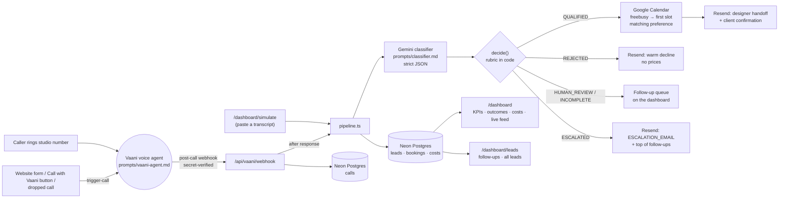

# Aangan Studio — Vaani call qualification

Aangan Studio (Pune interior design) was missing about half its enquiries. This system answers every enquiry call, day or night, with a voice agent (**Vaani**), then:

1. qualifies the lead against Nikhil's rubric ([`context/qualified.md`](context/qualified.md)) with Gemini,
2. books a free consultation with a designer on Google Calendar,
3. emails the designer a handoff note so they never re-ask anything,
4. puts every call that needs a person into a follow-up queue, and
5. shows Nikhil a dashboard of what happened and what it cost.

Phone only. WhatsApp and the web form are out of scope (see [Extending to other channels](#extending-to-other-channels)).

## Architecture



| Piece | Where |
|---|---|
| Vaani system prompt | [`prompts/vaani-agent.md`](prompts/vaani-agent.md) |
| Classifier prompt | [`prompts/classifier.md`](prompts/classifier.md) (+ `services.md`, `qualified.md` appended at runtime) |
| Decision rules (deterministic) | [`src/lib/classification.ts`](src/lib/classification.ts) → `decide()` |
| Post-call pipeline | [`src/lib/pipeline.ts`](src/lib/pipeline.ts) |
| Slot finding | [`src/lib/slots.ts`](src/lib/slots.ts) |
| Vaani API + webhook adapter | [`src/lib/vaani.ts`](src/lib/vaani.ts) |
| Calendar / Resend | `src/lib/google-calendar.ts`, `resend.ts` |
| Schema | [`db/schema.sql`](db/schema.sql) |
| Database access (Neon) | [`src/lib/db.ts`](src/lib/db.ts) |

### Decisions worth knowing

- **Vaani never judges fit and never quotes a price.** Nikhil asked for the agent to quote per-sq-ft pricing; `pricing.md` itself says no number should reach a client, and a quote made before anyone has seen the site anchors the conversation wrongly. Vaani uses the one deflection line from `pricing.md`. The classifier never sees `pricing.md` — only the internal budget yardstick (₹3.5L/room, ₹1,200/sq ft), and only to check a budget the caller volunteered.
- **Gemini scores, code decides.** The model returns pass/fail/unclear with an evidence quote for each of the 5 criteria; `decide()` applies the decision order, so the outcome can't drift with the prompt. The model's own outcome is stored as `model_outcome` for audit.
- **Unclear on its own never rejects.** The brief's literal rule ("2+ criteria failing/unclear → REJECTED") would reject T14 (timeline and decision-maker unclear) and T16 (scope, timeline, decision-maker unclear), both of which must be QUALIFIED or HUMAN_REVIEW. `qualified.md` says *"Two or more criteria **fail**: decline"* and *"unclear on 4 or 5: do not push, treat as qualified"*. So: any fail on 1–4 → REJECTED; a decision-maker fail plus anything shaky → REJECTED (alone → HUMAN_REVIEW); unclear on 1–3 or confidence < 0.7 → HUMAN_REVIEW; budget not mentioned counts as pass.
- **Frustrated new enquirer ≠ escalation.** ESCALATED is for existing clients, complaints about delivered work, or explicit requests for a person. A new caller annoyed that nobody rang back (T16) is classified normally and flagged in the handoff.
- **Email, not Telegram, for the designer handoff.** Designers live in Google Calendar and email already; the invite and the handoff land in the same inbox, the note is long-form and searchable, and there's no bot to install per designer.
- **No CRM — the dashboard is the CRM.** Anything a person has to act on (escalations, needs-review, incomplete calls, qualified leads with no matching slot, declines with no email to send to) lands in the follow-up queue on `/dashboard/leads`, escalations first, then oldest. The front desk marks each one done with a note.
- **No booking when no slot matches.** If nobody is free at a time the client said suits them in the next 7 working days (Mon–Sat, 10am–7pm IST, 2 h lead time), the lead stays QUALIFIED and goes to the follow-up queue, rather than booking the client into a time they said doesn't work.
- **Every external step is independent.** A failing or unconfigured integration is recorded on the lead (`routing.steps`) and shown on the call page; the rest still run.

## Classifier test

```bash
npm run eval
```

Runs the classifier on phone transcripts T01–T20 (T08 is a missed call, skipped) and checks each outcome. Latest run, 19/19:

| Expected | Calls | Result |
|---|---|---|
| QUALIFIED | T01 T05 T06 T12 T15 T17 T20 | ✓ all qualified |
| REJECTED | T03 location · T04 scope (advice only) · T07 timeline · T10 budget · T19 scope (restaurant) | ✓ all rejected, with the right reason |
| ESCALATED | T09 | ✓ |
| HUMAN_REVIEW | T18 | ✓ |
| QUALIFIED or HUMAN_REVIEW | T02 T11 T13 T14 T16 | ✓ T02 qualified; T11 T13 T14 T16 review (timeline never asked) |

Three consecutive runs all matched 19/19. Classifying all 19 costs about ₹10.50 in Gemini tokens (about ₹0.55 a call). Unit tests for the decision rules and slot finder: `npm test`.

## Setup

### 1. Accounts and keys you need

| Service | What to get | Env vars |
|---|---|---|
| **Neon** | Postgres database (created: `aangan-studio-db`, Singapore, via the Vercel marketplace — the connection string is added to Vercel automatically) | `DATABASE_URL` |
| **Vaani** | API key (app.vaanivoice.ai → API Keys); `npm run vaani:setup` creates the agent | `VAANI_API_KEY`, `VAANI_AGENT_ID`, `VAANI_PHONE_NUMBER`, `VAANI_OUTBOUND_NUMBER`, `VAANI_WEBHOOK_SECRET`, `VAANI_RATE_PER_MIN` |
| **Gemini** | API key from Google AI Studio | `GEMINI_API_KEY`, `GEMINI_MODEL`, `GEMINI_INR_PER_1M_INPUT`, `GEMINI_INR_PER_1M_OUTPUT` |
| **Google Calendar** | OAuth client (Desktop or Web) + a refresh token for a studio Google account that has *Make changes to events* on every designer's calendar | `GOOGLE_CLIENT_ID`, `GOOGLE_CLIENT_SECRET`, `GOOGLE_REFRESH_TOKEN` |
| **Resend** | API key and a verified sending domain | `RESEND_API_KEY`, `RESEND_FROM`, `RESEND_INR_PER_EMAIL`, `ESCALATION_EMAIL` |
| **App** | Public URL, and a secret for the website enquiry endpoint | `APP_URL`, `ENQUIRY_SECRET` |

All variables are listed with comments in [`.env.example`](.env.example).

### 2. Local

```bash
npm install
cp .env.example .env.local      # fill in values (or: vercel env pull)
npm run db:migrate              # creates the tables in Neon
npm run eval                    # classifier test; writes data/eval-results.json
npm run seed                    # loads T01–T20 into the database (dry run: nothing is sent)
npm run dev
```

Open http://localhost:3000.

### 3. Database

The schema is in [`db/schema.sql`](db/schema.sql); `npm run db:migrate` applies it (safe to re-run). The app talks to Neon over HTTP with `@neondatabase/serverless`; only the server holds `DATABASE_URL`.

Add your real designers (the seed adds three placeholders on `designers.example`), e.g. in the Neon SQL editor:

```sql
delete from designers where email like '%@designers.example';
insert into designers (name, email, calendar_id) values
  ('Designer Name', 'designer@aangan.studio', 'designer@aangan.studio');
```

### 4. Vaani (app.vaanivoice.ai)

1. In the Vaani dashboard create an **API key** and put it in `.env.local` as `VAANI_API_KEY`. If the studio number is already in Vaani, add it as `VAANI_PHONE_NUMBER` (E.164, e.g. `+912012345678`).
2. Run `npm run vaani:setup`. It creates the agent (first run — saves `VAANI_AGENT_ID` to `.env.local`) or updates it, uploads [`prompts/vaani-agent.md`](prompts/vaani-agent.md) as the system prompt with the greeting and language auto-detect, and routes the studio number to it. Re-run it whenever the prompt changes.
3. In Vaani → **Settings → Webhooks**, add `https://<your-app>/api/vaani/webhook?secret=<VAANI_WEBHOOK_SECRET>`.
4. Copy `VAANI_API_KEY` and `VAANI_AGENT_ID` (and the phone number variables, if set) to Vercel.

How the app uses Vaani ([`src/lib/vaani.ts`](src/lib/vaani.ts), [docs](https://docs.vaanivoice.ai)):

- **Browser voice calls (no phone number needed)** → [`/talk`](src/app/talk/page.tsx): a visitor taps *Talk to Vaani*, the server starts a Vaani WebRTC session, and the browser joins it with LiveKit. When the call ends, Vaani's webhook brings the transcript in like any other call (tagged "web call"). Limits: 5 sessions per visitor per hour, 40 in total.
- **Phone features** (below) stay off until Vaani has a number: set `VAANI_TELEPHONY=on` to enable them.


- **Inbound calls** → Vaani's `call_postprocessing` webhook carries the transcript; the caller's number comes from Vaani's call history.
- **Outbound calls** (`POST /api/trigger-call/`), each with a callback brief passed as a per-call prompt override so Vaani doesn't re-ask what we know:
  - **Call with Vaani** button on every follow-up in the dashboard.
  - **Dropped calls**: an inbound call classified INCOMPLETE gets an automatic callback straight away.
  - **Web enquiries**: `/enquire` is a ready-made form, and `POST /api/enquiry?secret=<ENQUIRY_SECRET>` (JSON or form data: `name`, `phone`, `email`, `locality`, `message`) lets the studio website's own form trigger the same callback.
- When a callback succeeds, the follow-up it was for closes itself. No-answer / rejected / failed callbacks show on the follow-up.
- Guardrails: at most one automatic call per number per 24 h, 20 outbound calls per hour in total.

### 5. Deploy

The GitHub repo is connected to Vercel; every push to `main` deploys. Set the env vars above in Vercel → Project → Settings → Environment Variables.

## Dashboard

`/dashboard` — open to anyone with the link (no password). Callers' names, numbers and transcripts are visible, so add protection back before real calls go live.

- **KPIs:** calls answered, % after hours (outside 10am–7pm or Sunday), median time to first response (enquiry → Vaani on the line; 0 for every inbound call, because Vaani picks up), qualified, booked, cost this month, cost per qualified lead, estimated pipeline (qualified × ₹11L, labelled as an estimate — the midpoint of the ₹8–14L average project value).
- **Outcomes** donut, **Call → Qualified → Booked** step tracker, **rejection reasons**, **costs by source**, **live call feed** (refreshes every 8 s). Date filter: 7 days, 30 days, this month, last month, all time.
- **Costs** are logged per call: Vaani minutes × `VAANI_RATE_PER_MIN`, Gemini `usageMetadata` tokens × your per-token price, Resend emails × `RESEND_INR_PER_EMAIL`.
- **Leads & follow-ups** (`/dashboard/leads`): the front desk's queue — every call that needs a person, with the one question to ask and a tap-to-call number — plus a searchable list of every lead filtered by outcome. Mark a follow-up done with a note; reopen it if needed.
- **Simulate call** (`/dashboard/simulate`): paste a transcript (or load T01–T20) and it runs the same pipeline as a real call. Tick *dry run* to classify and store without booking calendars or sending email.
- Each call has a detail page; the designer's handoff email links straight to it.

The seeded data is September's front-desk calls, so the transcripts show a person, not Vaani; the costs are what Vaani would have cost for the same minutes.

## Extending to other channels

The pipeline only needs a transcript and a timestamp, so WhatsApp and the web form plug in at `insertCall()` → `processCall()`:

- **WhatsApp Business:** a webhook that collects a thread until the customer goes quiet, then sends the thread as the transcript. Vaani's rules (never price, never reject) become the auto-reply prompt.
- **Web form:** already wired — a form submission makes Vaani call the person back within a minute or two (see Vaani above).

## Scripts

| Command | What it does |
|---|---|
| `npm run dev` | Local dev server |
| `npm run eval` | Classifier test on T01–T20 |
| `npm run vaani:setup` | Create / update the Vaani agent from the prompt file |
| `npm run google:token` | Get the Google Calendar refresh token |
| `npm run db:migrate` | Create / update tables in Neon |
| `npm run seed` | Seed the database from the eval results (dry run) |
| `npm test` | Unit tests (decision rules, slot finder) |
| `npm run typecheck` | Route types + TypeScript |
