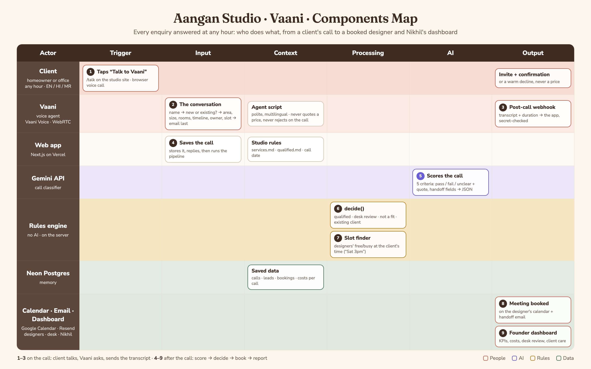
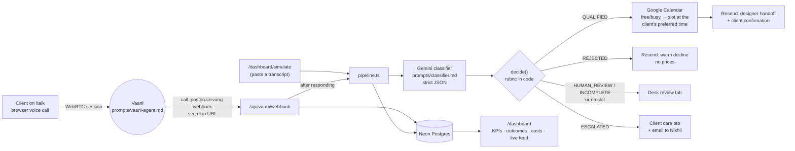

# Aangan Studio — Vaani call qualification

Aangan Studio (Pune interior design) was missing about half its enquiries: two people on the front desk, 10am–7pm, and a third of enquiries arriving outside those hours. This system makes sure every enquiry is answered, at any hour, by a voice agent called **Vaani**. After each call it:

1. qualifies the lead against Nikhil's rubric ([`context/qualified.md`](context/qualified.md)) with Gemini,
2. books a free consultation with a designer on Google Calendar, at the time the client asked for,
3. emails the designer a handoff note so they never have to re-ask anything,
4. routes anything a person must handle to the right team: **Desk review** for new enquiries, **Client care** for existing clients, and
5. shows Nikhil a dashboard of what happened and what it cost.

A class project (MESA, Founder's Office, Case 03), built as a working demo.

## Live demo

| | Link | Who it's for |
|---|---|---|
| **Talk to Vaani** | https://aangan-studio-beta.vercel.app/talk | Clients: the page Aangan would put on its website, Instagram bio and WhatsApp replies |
| **Founder dashboard** | https://aangan-studio-beta.vercel.app/dashboard | Nikhil |
| All leads | https://aangan-studio-beta.vercel.app/dashboard/leads | Nikhil and the team |
| Desk review | https://aangan-studio-beta.vercel.app/dashboard/review | Front desk |
| Client care | https://aangan-studio-beta.vercel.app/dashboard/client-care | Senior team |
| Simulate call | https://aangan-studio-beta.vercel.app/dashboard/simulate | Demo / testing |

### Demo script (about 5 minutes)

1. **Open `/talk` in Chrome**, tap **Talk to Vaani**, and allow the microphone.
2. **Play a new client.** Vaani greets you, asks your name, then asks *"Are you an existing Aangan customer, or a new customer?"* Say you're new, then answer her questions. For example:
   > "I have a 2BHK in Kothrud, about 850 sq ft. I want the kitchen, wardrobes and living room done, design and execution. By February. It's my own flat. Saturday at 3pm suits me, site visit please. I found you on Instagram."
3. **Ask her the price:** *"Roughly how much would that cost?"* She won't give a number. She explains the designer will cover it at the consultation (see [why](#decisions-worth-knowing)).
4. She asks for your email **last**, for the meeting invite, then closes with one line. No recap.
5. **About a minute after hanging up**, refresh the **dashboard**. The call appears in the live feed, tagged *web call*. Open it to see the transcript, the five criteria with evidence quotes, and the handoff.
6. **Show the booking.** On the dashboard, **Designer consultations** lists each designer's meetings. Click **Open in Google Calendar ↗** to show the real event on the designer's calendar (*Aryan / Meghna / Rohan · Aangan*), at Saturday 3pm or the next Saturday at 3pm if today's is too soon.
7. **Open your inbox.** The designer handoff email has arrived (the green banner shows who it would really go to).
8. **Show the other paths:**
   - **Client care:** an existing client's complaint (e.g. Meera Kulkarni).
   - **Desk review:** calls that were unclear or cut short.
   - **All leads:** searchable, filterable by outcome.
9. **Try Hindi:** start a call with *"Namaste, Baner mein mera 3BHK hai, poora ghar karwana hai…"*. Vaani answers in Hindi, and the dashboard still shows everything in English.

The dashboard holds the September case calls (T01–T20) plus test leads from building the system (Kavita Joshi, Arjun Mehta, Neha Kapoor, Meera Kulkarni and others). They're kept as examples on purpose.

## How it works





| Piece | Where |
|---|---|
| Vaani's script (uploaded to Vaani) | [`prompts/vaani-agent.md`](prompts/vaani-agent.md) |
| Classifier prompt | [`prompts/classifier.md`](prompts/classifier.md) (+ `services.md`, `qualified.md` appended at runtime) |
| Decision rules (deterministic) | [`src/lib/classification.ts`](src/lib/classification.ts) → `decide()` |
| Post-call pipeline | [`src/lib/pipeline.ts`](src/lib/pipeline.ts) |
| Booking: understands "Saturday at 3pm", "weekday evenings", "3 baje" | [`src/lib/slots.ts`](src/lib/slots.ts) |
| Vaani API, webhook and browser sessions | [`src/lib/vaani.ts`](src/lib/vaani.ts) |
| Client voice page | [`src/app/talk/`](src/app/talk) |
| Calendar / email | [`src/lib/google-calendar.ts`](src/lib/google-calendar.ts), [`src/lib/resend.ts`](src/lib/resend.ts), [`src/lib/emails.ts`](src/lib/emails.ts) |
| Database schema | [`db/schema.sql`](db/schema.sql) |

### What Vaani does on a call

- **Greets you:** "Hello, and thank you for calling Aangan Studio! This is Vaani. How may I help you today?"
- **Asks your name, then** "Hi [name], are you an existing Aangan customer, or a new customer?"
- **Existing customer:** takes the designer's name and the issue, promises a senior callback, and ends the call. The call lands in **Client care** and Nikhil is emailed.
- **New customer:** asks one question at a time:
  - confirms the number you're calling from
  - area, property type and size
  - rooms, and whether you want design and execution or just advice
  - completion date, owned or rented, who decides
  - preferred day and time, site visit or studio, how you heard of Aangan
  - your **email, last**, for the invite
- **Tone:** very polite and warm, without repeating "thank you" after every answer.
- **Language:** answers in English, Hindi or Marathi, whichever you speak, and switches when you do.
- **Never:** quotes a price, turns anyone down on the call, or asks about budget.
- **Ends** with one line: "Thank you — our team will get back to you shortly." No recap.

### Decisions worth knowing

- **Vaani never quotes a price, the one thing Nikhil asked for that we cut.** `pricing.md` itself says no number should reach a client, and a quote given before anyone has seen the site anchors the conversation wrongly. Vaani uses the one deflection line from `pricing.md`. The classifier never sees `pricing.md`, only the internal budget yardstick (₹3.5L/room, ₹1,200/sq ft), and only to check a budget the caller volunteered.
- **Vaani never judges fit on the call.** She collects; the system decides afterwards. Declines go out as a warm email ("reach out if your timeline or scope changes"), never on the phone.
- **Gemini scores, code decides.** The model returns pass/fail/unclear with an evidence quote for each of the five criteria; `decide()` applies the decision order, so the outcome can't drift with the prompt. The model's own outcome is stored as `model_outcome` for audit.
- **Unclear on its own never rejects.** The brief's literal rule ("2+ criteria failing/unclear → REJECTED") would reject T14 and T16, which must be QUALIFIED or HUMAN_REVIEW. `qualified.md` says *"Two or more criteria **fail**: decline"* and *"unclear on 4 or 5: do not push"*. So:
  - any fail on criteria 1–4 → REJECTED
  - a decision-maker fail plus anything shaky → REJECTED (on its own → HUMAN_REVIEW)
  - unclear on 1–3, or confidence < 0.7 → HUMAN_REVIEW
  - budget not mentioned counts as a pass
- **A frustrated new enquirer isn't an escalation.** ESCALATED is for existing clients, complaints about delivered work, or explicit requests for a person (→ Client care). A new caller annoyed that nobody rang back (T16) is classified normally and flagged.
- **Email, not Telegram, for the designer handoff.** Designers already live in Google Calendar and email: the invite and the handoff land in the same inbox, the note is long-form and searchable, and there's no bot to install per designer.
- **Book what the client asked for, or nothing.** The slot finder looks at every designer's free/busy for the first free hour that matches the client's stated preference: a specific time like "Saturday at 3pm", a window like "weekday evenings", or a day. The search covers 10am–7pm, Mon–Sat, within 7 working days, with at least 2 hours' notice. When several designers are free, the one assigned least recently gets it. If nothing matches, the lead goes to Desk review rather than being booked into a time the client didn't ask for.
- **No CRM: the dashboard is the CRM.** Desk review and Client care are the team's to-do lists. They mark each item done with a short note, and the note stays on the lead.
- **Browser voice instead of a phone line, for the demo.** Clients talk to Vaani on `/talk` through Vaani's WebRTC sessions, so no phone number is needed. Phone features are built but switched off (see [Turning on phone calls](#turning-on-phone-calls)).
- **Every external step is independent.** If an integration fails or isn't set up, that's recorded on the lead (`routing.steps`) and shown on the call page; the other steps still run.

## The dashboard

`/dashboard` is open to anyone with the link (no password, for the demo). Callers' names and transcripts are visible, so protection (e.g. Vercel Deployment Protection) should go back on before real calls.

- **KPIs:**
  - calls answered
  - % after hours (outside 10am–7pm, or Sunday)
  - median time to first response (Vaani picks up instantly, so 0 for inbound calls)
  - qualified and booked
  - cost this month, and cost per qualified lead
  - estimated pipeline: qualified × ₹11L, labelled as an estimate (the midpoint of the ₹8–14L average project value)
- **Charts:**
  - outcomes donut
  - Call → Qualified → Booked step tracker
  - rejection reasons
  - costs by source
  - live call feed (refreshes every 8 s)
- **Date filter:** last 7 days, last 30 days, this month, last month, all time.
- **Designer consultations:** each designer's upcoming meetings (and recent past ones) from Google Calendar, with the client, the place and a link to the real calendar event. This is the proof that qualified calls become meetings.
- **Two cards** link to **Desk review** (leads to call back) and **Client care** (existing-client concerns).
- **All leads:** a searchable list, filterable by outcome, showing which team each open lead is with.
- **Call page:** the transcript, the five criteria with evidence quotes, everything collected, the booking, what the system did at each step, and what the call cost.
- **Simulate call:** paste a transcript, or load one of T01–T20, and it runs the same pipeline as a real call. Tick *dry run* to skip calendar and email.
- **Costs are logged per call:**
  - Vaani: minutes × `VAANI_RATE_PER_MIN`
  - Gemini: tokens from `usageMetadata` × your per-token price
  - Resend: emails × `RESEND_INR_PER_EMAIL`

## Classifier test

```bash
npm run eval
```

Runs the classifier on phone transcripts T01–T20 (T08 is a missed call, so it's skipped) and checks each outcome. Three consecutive runs all matched **19/19**:

| Expected | Calls | Result |
|---|---|---|
| QUALIFIED | T01 T05 T06 T12 T15 T17 T20 | ✓ all qualified |
| REJECTED | T03 location · T04 scope (advice only) · T07 timeline · T10 budget · T19 scope (restaurant) | ✓ all rejected, with the right reason |
| ESCALATED | T09 | ✓ |
| HUMAN_REVIEW | T18 | ✓ |
| QUALIFIED or HUMAN_REVIEW | T02 T11 T13 T14 T16 | ✓ T02 qualified; T11 T13 T14 T16 review (timeline never asked) |

Classifying all 19 costs about ₹10.50 in Gemini tokens (about ₹0.55 a call). `npm test` runs 23 unit tests covering the decision rules, the slot finder (including "Saturday at 3pm") and Vaani's webhook format.

## Demo setup (how this instance is configured)

| Service | Demo configuration |
|---|---|
| **Vaani** (app.vaanivoice.ai) | Agent `aangan-studio-vaani`, configured from code with `npm run vaani:setup`. Female "Indian Lady" voice (Cartesia), multilingual speech recognition (English, Hindi, Marathi). Webhook: Vaani → Developers → Webhooks → Agent webhook, events *Call Post-processing, Rejected, No Answer, Failed*. |
| **Neon** | Postgres `aangan-studio-db` (Singapore), connected through the Vercel marketplace. |
| **Gemini** | `gemini-3.6-flash` for classification. |
| **Google Calendar** | One Google account. `npm run google:demo-calendars` creates a calendar per demo designer (*Aryan Kulkarni · Aangan*, *Meghna Iyer · Aangan*, *Rohan Shah · Aangan*) and links them. |
| **Resend** | Resend's test sender. `DEMO_INBOX` sends every email to the Resend account owner's inbox, with a banner naming the real recipient. With a verified domain, set `RESEND_FROM` and remove `DEMO_INBOX`. |

## Setting it up from scratch

```bash
npm install
cp .env.example .env.local      # fill in values (or: vercel env pull)
npm run db:migrate              # create tables in Neon
npm run eval                    # classifier test; writes data/eval-results.json
npm run seed                    # load T01–T20 into the database (nothing is sent)
npm run vaani:setup             # create/update the Vaani agent (needs VAANI_API_KEY)
npm run google:token            # sign in to Google; saves GOOGLE_REFRESH_TOKEN
npm run google:demo-calendars   # demo designer calendars
npm run dev
```

All environment variables are listed with comments in [`.env.example`](.env.example). The GitHub repo is connected to Vercel, so every push to `main` deploys; production env vars live in Vercel → Project → Settings → Environment Variables.

**Google Calendar OAuth client:**
1. In Google Cloud, enable the **Calendar API**.
2. Set up the consent screen: External, then **Publish app**, or the connection expires after 7 days.
3. Create an OAuth client of type **Desktop app**.

**Real designers instead of demo calendars:** each designer shares their calendar with the studio Google account (*Make changes to events*), then:

```sql
update designers set active = false;
insert into designers (name, email, calendar_id) values ('Designer Name', 'designer@aangan.studio', 'designer@aangan.studio');
```

### Turning on phone calls

Everything below is built, but stays off until Vaani has a phone number. To turn it on:
1. Add a number in Vaani and set `VAANI_PHONE_NUMBER` (E.164 format, e.g. `+912012345678`).
2. Re-run `npm run vaani:setup`.
3. Set `VAANI_TELEPHONY=on`.

That enables:
- **Inbound calls** to the studio number, handled by the same webhook and pipeline as browser calls.
- **"Call with Vaani"** buttons on Desk review items.
- **Automatic callback** when a call drops before Vaani gets the details.
- **Web enquiries:** `/enquire` and `POST /api/enquiry?secret=<ENQUIRY_SECRET>` (`name`, `phone`, `email`, `locality`, `message`) make Vaani ring the person within a minute or two.
- **Guardrails:** one automatic call per number per 24 h, and 20 outbound calls per hour.

## Extending to other channels

The pipeline only needs a transcript and a timestamp, so new channels plug in at `insertCall()` → `processCall()`:

- **WhatsApp Business:** a webhook collects a thread until the customer goes quiet, then sends it as the transcript. Vaani's rules (never quote a price, never reject) become the auto-reply prompt.
- **Web form:** already built (above). A form submission makes Vaani call the person back.

## Scripts

| Command | What it does |
|---|---|
| `npm run dev` | Local dev server |
| `npm run eval` | Classifier test on T01–T20 |
| `npm test` | Unit tests |
| `npm run seed` | Load T01–T20 into the database (dry run) |
| `npm run db:migrate` | Create / update tables in Neon |
| `npm run vaani:setup` | Create / update the Vaani agent from `prompts/vaani-agent.md` |
| `npm run google:token` | Sign in to Google Calendar, save the refresh token |
| `npm run google:demo-calendars` | Create demo designer calendars and link them |
| `npm run typecheck` | Route types + TypeScript |
